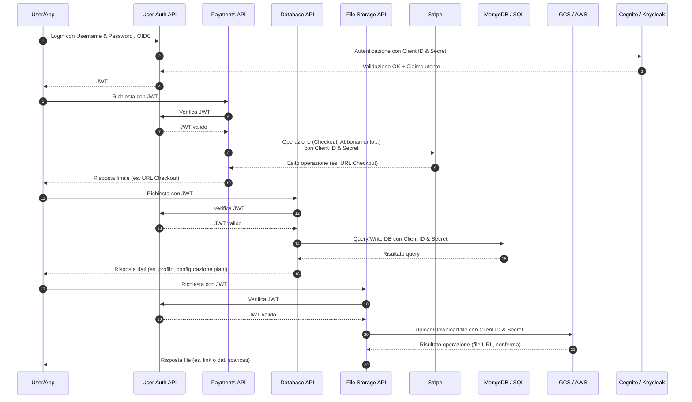
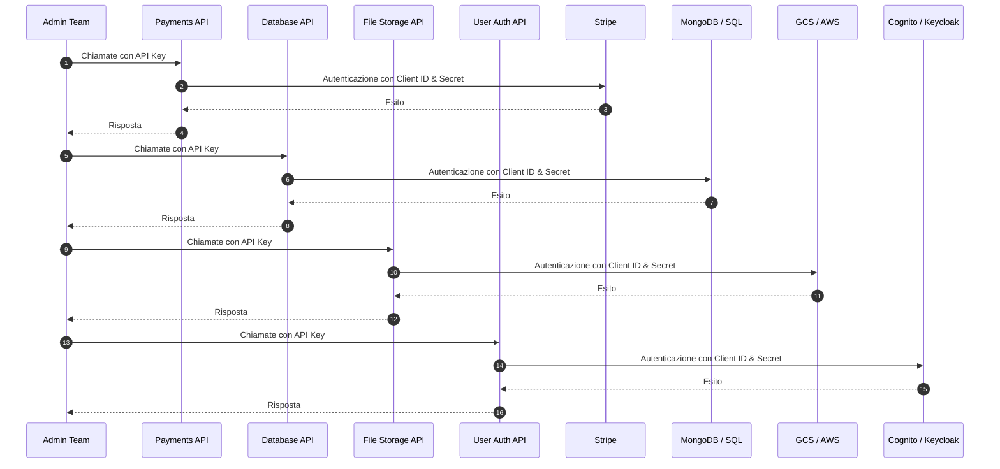

# Architettura Backend – Documento Descrittivo

## 1. Panoramica generale

L’architettura è progettata per separare nettamente due **lati di utilizzo**:

* **Admin Side** → Il team interno che gestisce e configura il sistema, con privilegi amministrativi.
* **App/User Side** → L’applicazione lato utente finale, attraverso cui gli utenti si registrano, accedono, effettuano pagamenti e gestiscono i propri servizi.

L’architettura si fonda sull’uso di **provider esterni** (Stripe, Cognito/Keycloak, database, file storage) e un insieme di **API intermedie** sviluppate ad hoc che fungono da **livello di astrazione** e **controllo della sicurezza**.
Gli utenti finali **non comunicano mai direttamente** con i provider esterni, ma sempre tramite le API intermedie.

---

## 2. Provider esterni e funzioni principali

###  Stripe (Pagamenti)

* **Admin side** → uso della **Dashboard Stripe** per configurare prodotti, prezzi, piani di abbonamento, monitorare transazioni, gestire rimborsi.
* **API intermedia (Payments API)** → espone endpoint per la creazione di sessioni di pagamento (Checkout), generazione di link al Billing Portal, gestione degli abbonamenti e recupero storico fatture.

###  Database (MongoDB o SQL)

* **Admin side** → gestione tramite strumenti ufficiali (MongoDB Atlas, pgAdmin, ecc.) per:

  * Creare/modificare schemi e collezioni/tabelle
  * Monitorare performance e query
  * Gestire backup e restore
* **API intermedia (Database API)** → fornisce un’interfaccia sicura per CRUD e query controllate. Gli utenti accedono solo via API, non direttamente al DB.

###  File Storage (Google Cloud Storage o AWS S3)

* **Admin side** → gestione tramite console GCP o AWS per:

  * Configurare bucket e regole di sicurezza
  * Monitorare storage, costi e performance
* **API intermedia (File Storage API)** → gestisce upload, download e gestione permessi. Si occupa anche di generare URL firmati temporanei.

###  Identity Provider (Cognito o Keycloak)

* **Admin side** → gestione utenti via console (creazione manuale, reset password, configurazione provider social login).
* **API intermedia (User Authentication API)**:

  * Riceve username/password o redirect da provider OIDC/Social
  * Rilascia un **JWT** all’utente autenticato
  * Espone endpoint per refresh token, cambio password, gestione MFA

---

## 3. API intermedie (livello applicativo)

Le API intermedie sono sviluppate in **Python (FastAPI o simili)** e comunicano con i provider esterni mediante **client ufficiali** autenticati tramite **client\_id e client\_secret**.

### Principali API:

1. **User Authentication API**

   * Autenticazione e registrazione
   * Social login via OIDC/OAuth
   * Rilascio e verifica di token JWT
   * Gestione attributi e MFA
2. **Payments API**

   * Creazione Checkout session
   * Gestione abbonamenti e rimborsi
   * Portale di fatturazione
   * Validazione e gestione webhook Stripe
3. **Database API**

   * Operazioni CRUD sicure
   * Accesso controllato a dati specifici per utente
4. **File Storage API**

   * Upload/download file
   * Generazione di link firmati
   * Gestione storage multitenant

---

## 4. Flussi di interazione

###  4.1 Autenticazione utente

1. L’utente invia **username e password** (o credenziali OIDC) alla **User Auth API**.
2. L’API contatta Cognito/Keycloak per validare credenziali.
3. Se corrette, rilascia un **JWT** all’utente.

###  4.2 Accesso alle altre API

1. L’utente chiama ad esempio la **Payments API** passando il JWT nell’header `Authorization: Bearer <token>`.
2. La Payments API contatta la **User Auth API** per validare il token.
3. Se valido, esegue l’operazione (es. creazione Checkout Session in Stripe).

###  4.3 Flusso lato admin

1. Il team Admin usa direttamente le **Dashboard dei provider** (Stripe, DB, GCP/AWS, Cognito).
2. In alternativa, può usare le stesse **API intermedie**, autenticandosi con **API Key** (ruolo admin).

   * Esempio: creare manualmente un piano via Payments API senza passare da Stripe Dashboard.

---

## 5. Esempi pratici

###  Caso 1 – Registrazione e acquisto piano

1. L’utente si registra via **User Auth API** → riceve un JWT.
2. Entra nell’app → seleziona un piano.
3. L’app chiama **Payments API** (`/plans/checkout`) passando il JWT.
4. La Payments API valida il token, crea un Checkout Session su Stripe.
5. L’utente completa il pagamento su pagina Stripe.
6. Stripe invia un webhook → Payments API → DB aggiornato.

---

###  Caso 2 – Upload file utente

1. L’utente autenticato chiama **File Storage API** (`/files/upload`).
2. L’API valida il JWT, genera un URL firmato per GCS/AWS.
3. L’utente carica il file usando quell’URL.
4. L’Admin può accedere ai file via console cloud o API.

---

###  Caso 3 – Operazioni Admin su piani

1. L’Admin vuole creare un nuovo piano.
2. Può farlo via **Stripe Dashboard** (interfaccia ufficiale), **oppure** via **Payments API** usando API Key admin.
3. Il piano diventa disponibile per gli utenti nell’app.

---

## 6. Vantaggi dell’architettura

* **Sicurezza**: utenti mai esposti direttamente ai provider → tutto passa per le API controllate.
* **Scalabilità**: separazione chiara tra servizi e API facilita scaling indipendente.
* **Multi-tenant ready**: ogni chiamata è tracciata per utente via `sub` del JWT.
* **Manutenibilità**: l’Admin ha doppio accesso (dashboard + API intermedie).
* **Flessibilità**: sostituzione di provider (es. Cognito ↔ Keycloak) senza cambiare logica app.

---

## 7. Diagrammi di flusso (Sequence)

### 7.1 Flusso autenticazione e utilizzo API (user)

### 7.2 Flusso autenticazione e utilizzo API (admin)

