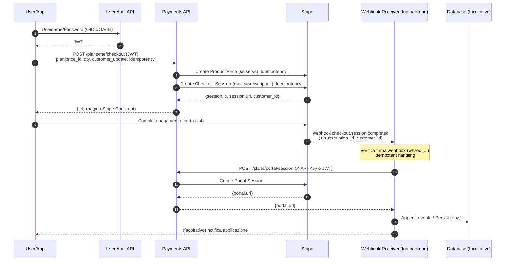
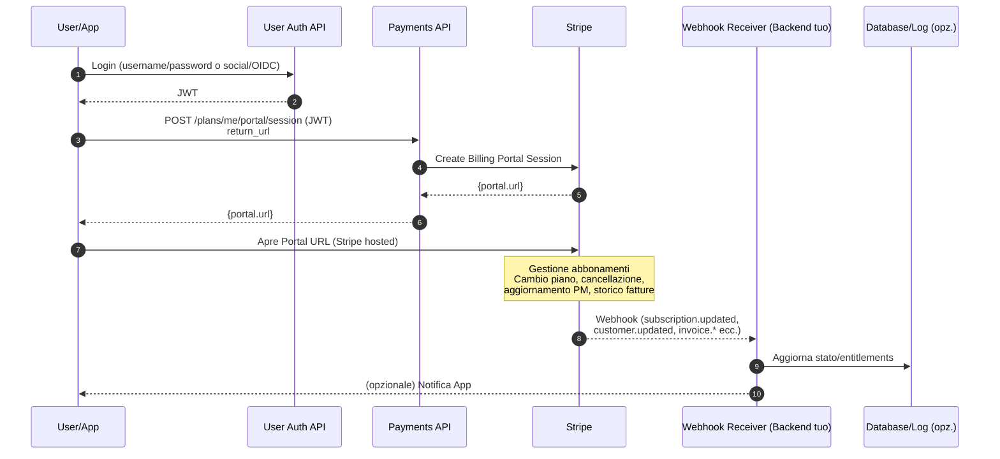
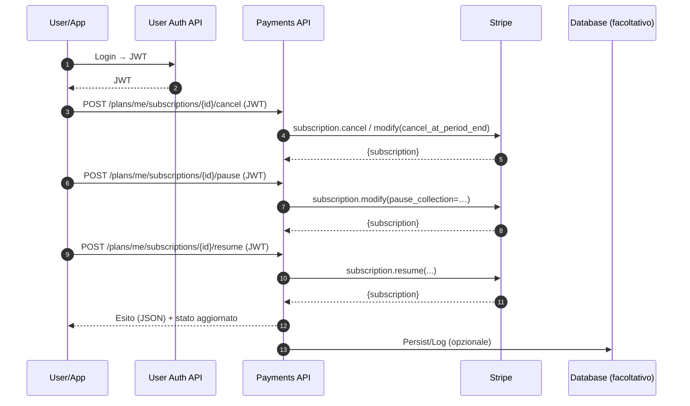
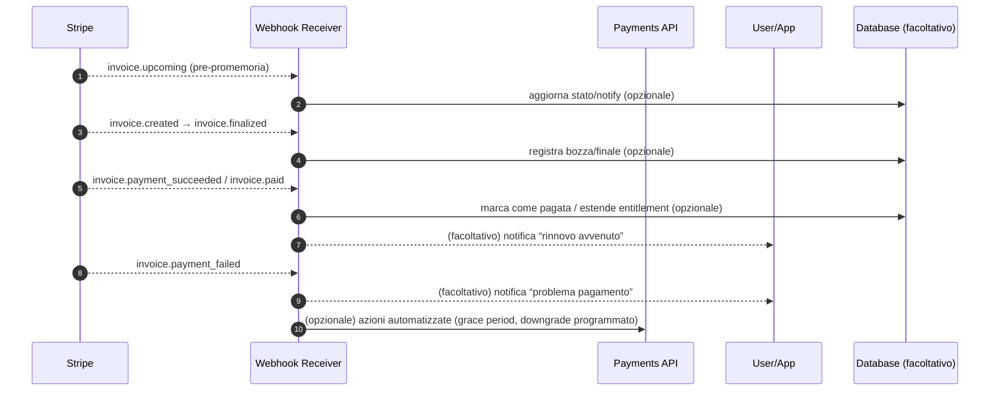
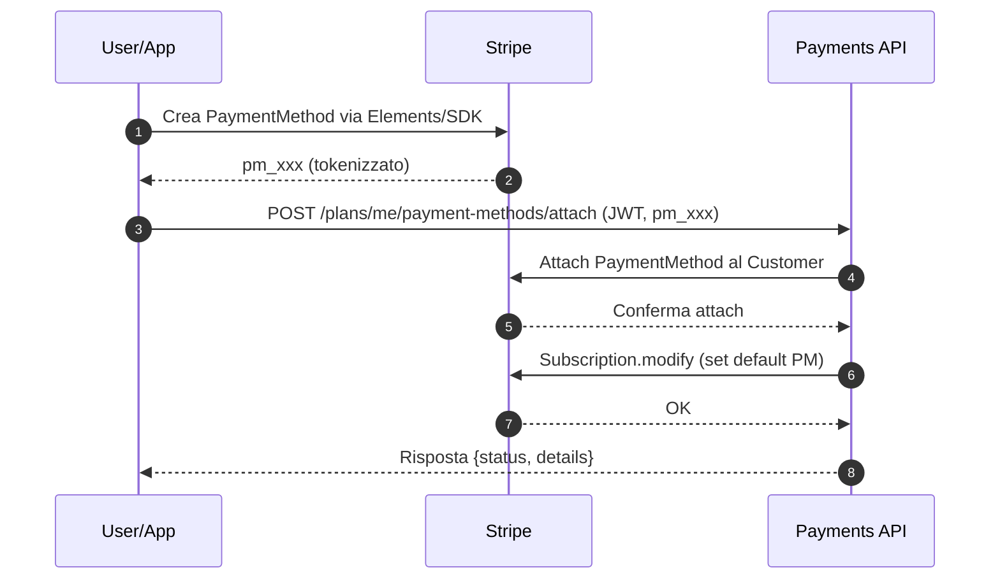
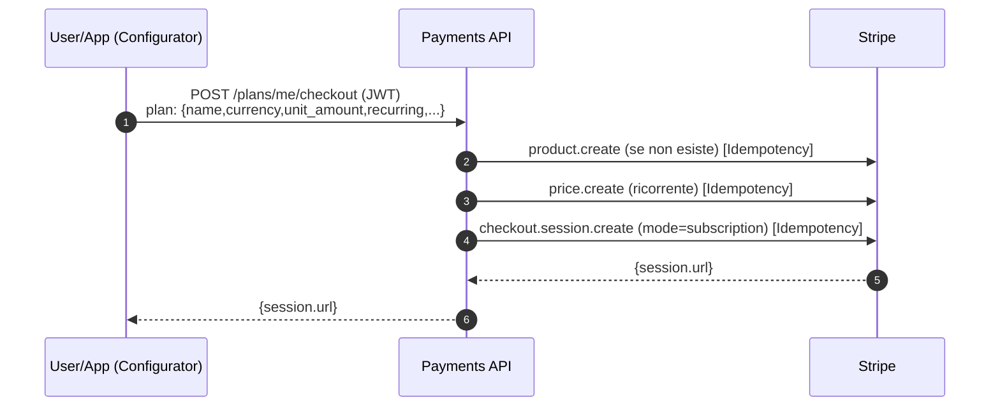

# 1) Checkout (creazione sessione) + Webhook

**Note chiave**

* **JWT** sul client → **Payments API**; **Payments API ↔ Stripe** con **Client ID/Secret**.
* Usa **Idempotency-Key** dedicata per *ogni* POST verso Stripe.
* Il **webhook** verifica la firma (`whsec_...`) e può generare subito un **Portal URL**.

---

# 2) Gestione abbonamento via **Billing Portal** (Stripe-hosted)

**Perché conviene**

* Minimizza UI custom e compliance burden (SCA, PCI).
* Ottieni gestione piani, metodi di pagamento, fatture “out-of-the-box”.

---

# 3) Gestione abbonamento via **API** (server-side)

(*upgrade/downgrade/cancel/pause/resume* senza passare dal Portal)

**Spiegazione rapida dei passaggi**

1. User → login presso User Auth API per ricevere il JWT. 
2. L’utente invoca /plans/me/portal/session con il JWT. 
3. Payments API crea una Portal Session presso Stripe. 
4. Stripe restituisce un portal.url, che la Payments API inoltra all’utente. 
5. L’utente apre il Portal (UI Stripe-hosted) ed esegue azioni (upgrade/downgrade, cancellazione, update metodi di pagamento). 
6. Stripe emette webhook events (subscription.updated, invoice.paid, ecc.). 
7. Il Webhook Receiver li valida e aggiorna il DB o invia notifiche all’app.

**Quando usarlo**

* Hai una UI personalizzata e vuoi un controllo granulare (UX su misura, automazioni, policy).

---

# 4) Rinnovi, Fatture e Pagamenti ricorrenti

**Tip**

* Gestisci **state machine** lato tuo DB (“active”, “past\_due”, “canceled”, …) sincronizzata con webhook Stripe.

---

# 5) Aggiornamento / Aggiunta **Metodo di Pagamento**

**Spiegazione**

1. User/App usa Stripe Elements/SDK per raccogliere i dati carta e genera un PaymentMethod tokenizzato (pm_xxx). 
2. L’utente invia il token pm_xxx al backend tramite la rotta POST /plans/me/payment-methods/attach, autenticandosi con JWT. 
3. La Payments API chiama Stripe per associare il PaymentMethod al Customer corrispondente.
4. (Opzionale) la Payments API imposta il PM come default per una Subscription. 
5. Infine, la Payments API risponde all’utente con l’esito.

**Alternative**

* Far fare tutto dal **Portal** (nessuna UI custom) → vedi Diagramma 2.

---

# 6) Creazione dinamica del **piano** (Product/Price) + Checkout

(*quando non usi price preconfigurati*)

**Best practice**

* Genera **Idempotency-Key** per ciascuna chiamata (`…:product.create`, `…:price.create`, `…:checkout.create`).
* Se abiliti `automatic_tax`, assicurati **customer address** valido **o** `customer_update.address='auto'`.

---

## Suggerimenti operativi (riassunto)

* **Scegli Portal** quando vuoi “**move fast**”: meno codice, UX standard, update PM/fatture/upgrade/cancel già pronti.
* **Scegli API pure** quando ti serve **massimo controllo** e UI 100% personalizzata.
* Mantieni **webhook** idempotenti e con **verifica firma**.
* Conserva nel tuo DB lo **stato derivato** (entitlements/licenze), non duplicare i dati fiscali di Stripe.
* In **Test mode**, documenta bene la differenza tra *customer* e *user* nella tua app; usa un mapping stabile (es. claim `sub` del JWT ⇄ `internal_customer_ref` su Stripe).

Se vuoi, posso generarti i **file separati** (uno per diagramma) o comporre un **README** completo con i frammenti Mermaid già divisi e pronti per il rendering.
